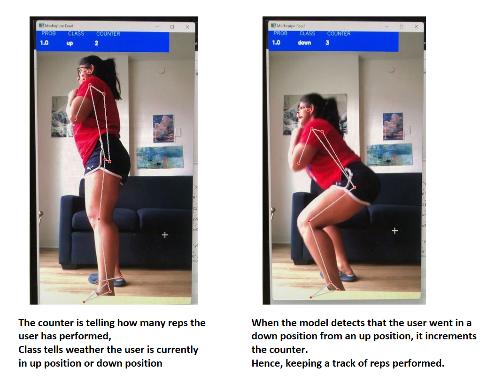
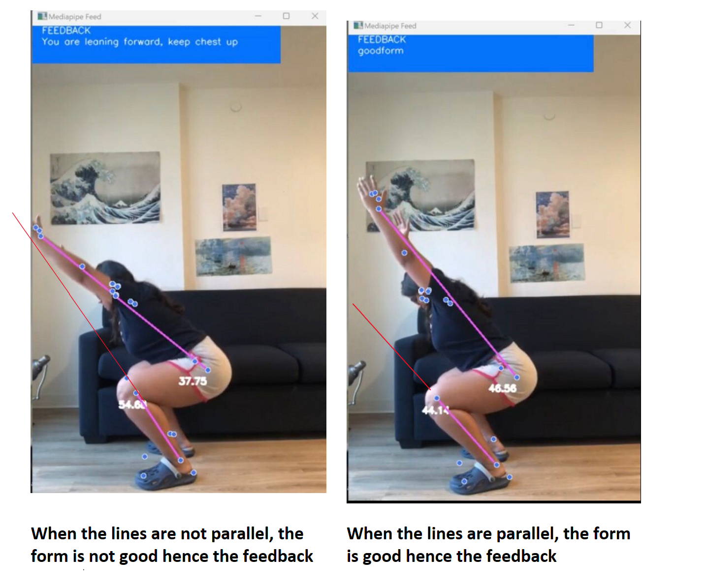

https://www.figma.com/design/uB2kkQxGTGVmBlkkxjacQO/formFriend?node-id=0%3A1&t=ceITWw9liYPYmqeC-1
# formFriend

Website: Welcome to your Machine Learning and Computer vision powered personal trainer that will help you detect your form compensations when you exercise.

## Form Compensation Detector and Rep Counter

Welcome to your Machine Learning and Computer vision powered personal trainer that will help you detect your form compensations when you exercise.

### MOTIVATION

We love exercising and fitness and recently started noticing that a lot of people can learn about exercises by a simple chrome search but then they don't really know if you are doing it right.

### SQUATS

When you do a squat, the three most common compensations are forward lean, knees caving and toes turning outward. A way to test the forward lean is doing a squat with your hands overhead and looking to see if the lines formed from your wrist to hip and the line from your knee to the ankle are parallel. If they are not parallel, then you are leaning forward.

### TECH PROCESS

To identify the compensation, we utilized OpenCV and Mediapipe to first make detections about what position is the person currently in (up or down) while doing a squat. If they are in the down position then I calculated the angles formed by their torso and their knees to see if they are leaning forward. we then display the feedback based on the calculations on the screen. If the person leans forward, the app tells them that their form is wrong else it says "good form."

To count reps: we first collected some data about landmarks and body coordinates by recording myself doing some squats. Based on this data, we trained a machine learning model using algorithms such as Ridge, RandomForest, LogisticRegression, and GradientBoosting models to predict if the user is in the down or up position. All algorithms had good accuracy so I went ahead with the RandomForest to build my machine learning model.

### Demo

We built the full-stack website using the MERN (MongoDB, Express, React, Node.js) tech stack. Leveraging our experience with React, we implemented routing to different pages for rep counting and form detection.
